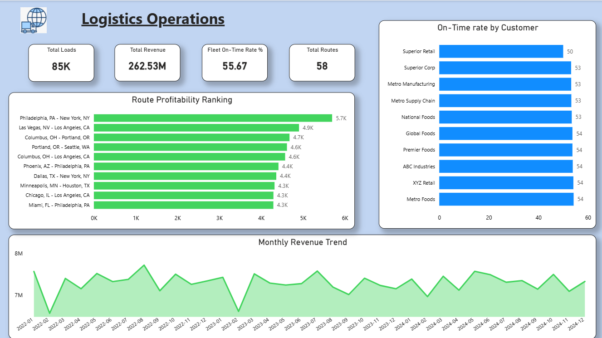
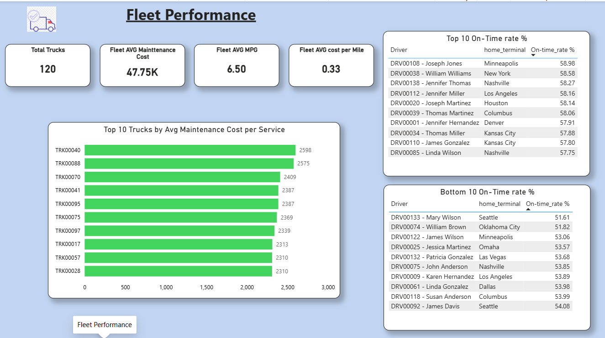

# Logistics Operations — SQL + Power BI + AI (Project 6)

AI-powered logistics analytics using SQL Server (T-SQL) + Power BI — driver 
performance, route profitability, fuel efficiency, maintenance cost and revenue 
trends across a 3-year trucking operations dataset.

---

## Project Overview

This project analyses a synthetic trucking operations database spanning 2022–2024, 
covering 14 relational tables with over 550,000 rows of transactional data. The 
analysis was built using T-SQL in SQL Server Management Studio (SSMS) and visualised 
in a two-page Power BI dashboard. AI assistance (Claude by Anthropic) was used 
throughout the analytical process to accelerate query development and insight 
generation — reflecting how modern data analysts leverage AI tools in real-world 
workflows.

The dataset was sourced from Kaggle:
[Logistics Operations Database](https://www.kaggle.com/datasets/yogape/logistics-operations-database)

---

## Dashboard Preview

### Page 1 — Operations Overview

### Page 2 — Fleet Performance

---

## Tools & Techniques

| Tool | Usage |
|---|---|
| SQL Server (T-SQL) | 6 analytical queries across 14 relational tables |
| Power BI Desktop | Two-page interactive dashboard |
| SSMS Import Wizard | CSV import for all 14 tables |
| AI (Claude by Anthropic) | Query development & insight generation |
| GitHub | Version control & portfolio publishing |

---

## Database Overview

| Table | Row Count |
|---|---|
| fuel_purchases | 196,442 |
| delivery_events | 170,820 |
| loads | 85,410 |
| trips | 85,410 |
| driver_monthly_metrics | 4,464 |
| truck_utilization_metrics | 3,312 |
| maintenance_records | 2,920 |
| customers | 200 |
| trailers | 180 |
| safety_incidents | 170 |
| drivers | 150 |
| trucks | 120 |
| routes | 58 |
| facilities | 50 |

---

## SQL Queries

### Query 1 — Driver Performance Scorecard
Joins `drivers`, `trips`, and `delivery_events` to score each driver on total 
trips, average MPG, average idle time, and on-time delivery rate. Uses `RANK()` 
window function to rank all 150 drivers by on-time performance.

**Key Findings:**
- 124 active drivers completed trips; 26 recorded no trip activity
- On-time delivery rates ranged from **58.98%** (Joseph Jones, Minneapolis) 
  to **51.61%** (Mary Wilson, Seattle)
- Fleet average MPG clustered tightly at **6.5 MPG** across all drivers
- Average idle time of **7.0 hours per trip** represents a key cost driver

---

### Query 2 — Route Profitability Analysis
Uses a CTE to calculate total revenue, fuel surcharge, accessorial charges, 
and revenue per mile for all 58 routes. Routes ranked using `RANK()` by 
revenue per mile descending.

**Key Findings:**
- Revenue per mile ranged from **$5,696** (Philadelphia → New York, 92 miles) 
  to **$2,605** (Las Vegas → New York, 2,561 miles)
- Short-haul, high-frequency lanes consistently outperform long-haul routes 
  on a revenue-per-mile basis
- Load counts were consistent across all routes (1,429–1,537 loads), confirming 
  revenue differences are driven by rate structure and distance, not volume

---

### Query 3 — On-Time Delivery Performance by Customer
Joins `customers`, `loads`, and `delivery_events` to calculate on-time rate, 
average detention minutes, and total loads per customer. Flags customers below 
55% on-time rate using `CASE WHEN`.

**Key Findings:**
- 200 customers analysed; on-time rates ranged from **50.00%** to **60.70%**
- Superior Retail recorded the worst performance at 50% on-time with 
  90.75 avg detention minutes
- Detention time and on-time rate are closely correlated across all customers
- The tight 10% spread suggests systemic network challenges rather than 
  customer-specific issues

---

### Query 4 — Fuel Efficiency & Cost Analysis
Uses a CTE to calculate average MPG, total fuel cost, and cost per mile by 
truck. Compares each truck against the fleet average using `OVER()` window 
function.

**Key Findings:**
- Fleet average MPG: **6.5** across all makes and model years (2015–2021)
- Fuel cost per mile ranged narrowly from **$0.31 to $0.35** across the fleet
- 28 trucks in Inactive or Maintenance status generated zero revenue
- Operational uniformity confirms route distance and diesel prices are the 
  primary fuel cost drivers, not individual truck efficiency

---

### Query 5 — Fleet Maintenance Cost & Downtime
Uses a CTE to calculate total maintenance cost, number of services, average 
cost per service, labor vs parts breakdown, and total downtime hours by truck. 
Ranked by average cost per service descending.

**Key Findings:**
- Average cost per service ranged from **$2,598** (TRK00040) to **$1,189** 
  (TRK00083) — a $1,409 spread
- Parts cost accounts for **70–80%** of total service cost across all trucks
- TRK00003 (Peterbilt 2018) recorded the highest total maintenance spend 
  at **$90,161** across 41 service events
- Fleet average maintenance cost per truck: **$47,754**

---

### Query 6 — Monthly Load Volume & Revenue Trend
Groups `loads` by year and month using a CTE. Calculates month-over-month 
load volume change, revenue change, and MoM % using `LAG()` window function.

**Key Findings:**
- 36 months analysed (January 2022 – December 2024)
- Monthly load volumes ranged between **2,136 and 2,496** loads
- Monthly revenue ranged from **$6.6M to $7.7M**
- Consistent February dip across all 3 years: -13.11% (2022), -10.90% (2023), 
  -5.63% (2024)
- Sharp March recovery every year: +12.58% (2022), +13.46% (2023), +6.93% (2024)
- No significant growth trend over 3 years — revenue growth requires network 
  expansion or rate increases

---

## Power BI Dashboard

### Page 1 — Operations Overview
- KPI Cards: Total Loads (85K), Total Revenue ($262.53M), Fleet On-Time Rate % 
  (55.67%), Total Routes (58)
- Route Profitability Ranking (Top 10 routes by revenue per mile)
- Bottom 10 Customers by On-Time Delivery Rate
- Monthly Revenue Trend (2022–2024 area chart)

### Page 2 — Fleet Performance
- KPI Cards: Total Trucks (120), Fleet Avg Maintenance Cost ($47.75K), 
  Fleet Avg MPG (6.50), Fleet Avg Fuel Cost per Mile ($0.33)
- Top 10 Trucks by Avg Maintenance Cost per Service
- Top 10 & Bottom 10 Drivers by On-Time Rate

---

## Key Business Insights

1. **On-time delivery is a network problem, not a driver problem** — the tight 
   7% spread across 124 drivers points to systemic scheduling and routing issues
2. **Short-haul lanes are significantly more profitable per mile** — the 
   Philadelphia–New York route generates 2.2x the revenue per mile of the 
   longest routes
3. **Parts cost drives maintenance spend** — 70–80% of all service cost is parts, 
   not labour. Supplier pricing and component failure rates are the key levers
4. **February is structurally weak every year** — consistent -10 to -13% revenue 
   dip requires proactive capacity planning
5. **Fleet fuel efficiency is uniform** — at 6.5 MPG across all makes and model 
   years, cost reduction focus should be on route optimisation, not equipment 
   replacement

---

## Repository Structure

Logistics-Operations-SQL_PowerBI-AI/
├── SQL/
│   ├── Query1_Drivers_Performance_Scorecard.sql
│   ├── Query2_Route_Profitability_Analysis.sql
│   ├── Query3_On_Time_Delivery_Performance_by_Customer.sql
│   ├── Query4_Fuel_Efficiency_Cost_Analysis.sql
│   ├── Query5_Fleet_Maintenance_Cost_Downtime.sql
│   └── Query6_Monthly_Load_Volume_Revenue_Trend.sql
├── PowerBi/
│   └── LogisticsOperations.pbix
├── Queries_and_Conclusion/
│   └── Project_6_Queries_and_Conclusions.docx
├── Screenshots/
│   ├── Page1_Operations_Overview.png
│   └── Page2_Fleet_Performance.png
└── README.md

## Related Projects

- [Project 1 — DataCo Supply Chain Analysis](https://github.com/jurgensp09-ship-it/Supply-Chain-SQL-Analysis)
- [Project 2 — Sales & Employee Performance](https://github.com/jurgensp09-ship-it/Sales-Employee-Performance-SQL-PowerBI)
- [Project 3 — HR Analytics SQL + Power BI](https://github.com/jurgensp09-ship-it/HR-Analytics-SQL-PowerBI)
- [Project 4 — Inventory Stock Management](https://github.com/jurgensp09-ship-it/Inventory-Analytics-SQL-PowerBI)
- [Project 5 — HR Analytics Dashboard](https://github.com/jurgensp09-ship-it/HR-Analytics-PowerBI-Dashboard)
